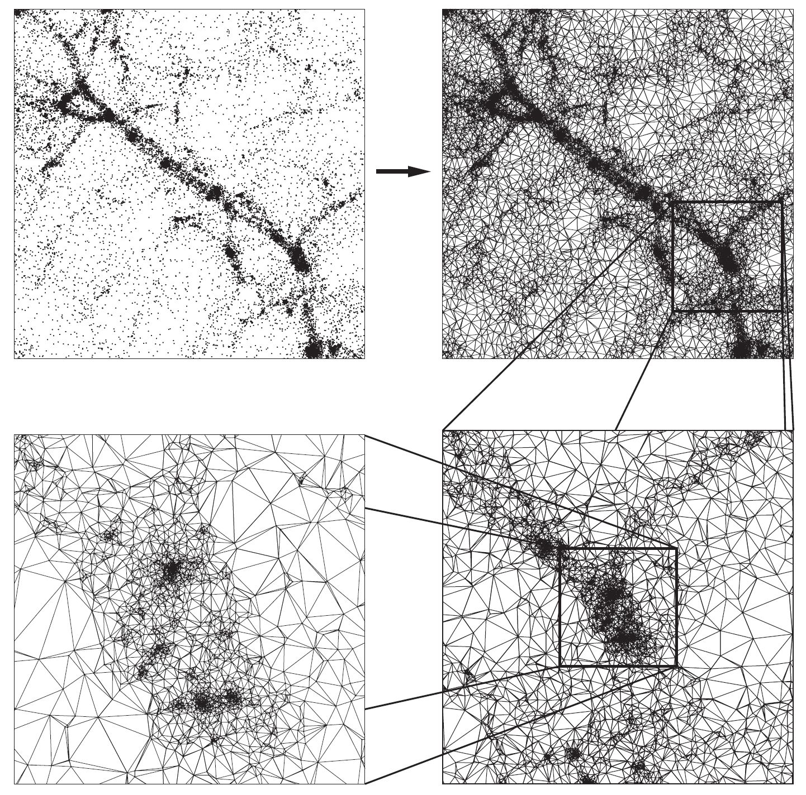
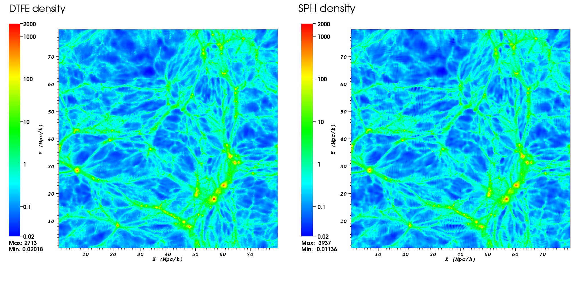
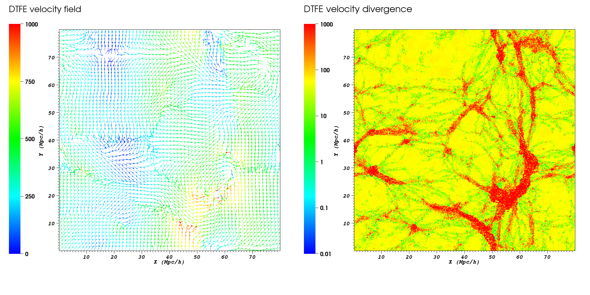

# The DTFE public software

The DTFE public code is a C++ implementation of the **Delaunay Tessellation Field Interpolation (DTFE)** method. Its purpose is to interpolate quantities stored at the location of an unstructured set of points to a regular grid using the maximum of information contained in the input points set. In particular, the code can calculate the following cosmological quantities:
* the density field - this is calculated directly from the point distribution,
* the velocity field and derivatives (e.g. gradient, divergence, vorticity) - uses the velocity at each particle position, and
* general vector quantities and their derivatives - these quantities must be given as input for each point in the set.

The code was written with the purpose of analysing cosmological simulations and galaxy redshift survey. Even though the code was designed with astrophysics in mind, it can be used for problems in a wide range of fields where one needs to interpolate from a discrete set of points to a grid.

The code was designed using a modular philosophy and with a wide set of features that can easily be selected using the different program options. The DTFE code is also written using OpenMP directives which allow it to run in parallel on shared-memory architectures.

The code comes with a complete [documentation](documentation/DTFE_user_guide.pdf) and with a multitude of examples that detail the program features. A test dataset and analysis of the code output is given in the [demo directory](demo).

The public release of the code is summarised in the arxiv publication [Cautun et al. (2011)](https://ui.adsabs.harvard.edu/abs/2011arXiv1105.0370C/abstract) and it is based on the method paper [Schaap and van de Weygaert (2000)](https://ui.adsabs.harvard.edu/abs/2000A%26A...363L..29S/abstract).


## The DTFE method
The Delaunay Tessellation Field Interpolation (DTFE) method represents the natural way of going from discrete samples/measurements to values on a periodic grid and it is especially suitable for astronomical data due to the following reasons:
* Preserves the multi-scale character of the point distribution. This is the case in numerical simulations of large scale structure where the density varies over more than 6 orders of magnitude.
* Preserves the local geometry of the point distribution. This is important in recovering sharp features like the different components of the cosmic web (i.e. clusters, filaments, walls and voids).
* The method does not depend on user defined parameters or choices.
* The interpolated fields are volume weighted (versus mass weighted quantities in most other interpolation schemes). This can have a significant effect especially when comparing with analytical predictions which are volume weighted.

For detailed information about the DTFE method see [Schaap and van de Weygaert (2000)](https://ui.adsabs.harvard.edu/abs/2000A%26A...363L..29S/abstract), [van de Weygaert and Schaap (2009)](https://ui.adsabs.harvard.edu/abs/2009LNP...665..291V/abstract), and [Cautun et al. (2011)](https://ui.adsabs.harvard.edu/abs/2011arXiv1105.0370C/abstract).

|  |
|:------:|
| Figure 1: *An illustration of the 2D Delaunay tessellation of a set of particles from a cosmological simulation. Courtesy: Willem Schaap.* |

|  |
|:------:|
| Figure 2: *An example of the DTFE density field form a cosmological simulation. The right panel shows the same result but now using the smoothed particle hydrodynamics (SPH) method.* |

|  |
|:------:|
| Figure 3: *A map of the DTFE computed velocity flow (left panel) and velocity divergence (right panel) corresponding to the density field shown in Figure 2.* |


## Summary of software features

* Works in both 2 and 3 spatial dimensions.
* Interpolates the fields to three different types of grids:
  + Regular rectangular and cuboid grid - useful for cosmological simulation.
  + Redshift cone (spherical coordinates) grid - useful for galaxy redshift survey or for mock observations.
  + User given sampling points - can describe any complex or non-regular sampling geometry
* Returns both the value at the centre of each cell of the interpolation grid as well as the value averaged over each cell.
* Uses the point distribution to compute the density and interpolates the result to grid.
* Each sample point has a weight associated to it to represent multiple resolution N-body simulations and observational biases for galaxy redshift surveys.
* Interpolates the velocity, velocity gradient, velocity divergence, velocity shear and velocity vorticity.
* Interpolates any additional number of fields and their gradients to grid.
* Periodic boundary conditions.
* Zoom in option for regions of interest.
* Splitting the full data in smaller computational chunks when dealing with limited CPU resources.
* The computation can be distributed in parallel on shared-memory architectures.
* For comparison purposes, the software comes also with three other simpler interpolation techniques: nearest grid point (NGP), triangular shape cloud (TSC) and smoothed particle hydrodynamics (SPH).
* Returns the Delaunay tessellation of the given point set.
* Easy change of input/output data format.
* Easy to use as an external library.
* Extensive documentation of each feature.


## Installation and Building

### Supported Platforms
- **macOS** (Intel and Apple Silicon)
- **Linux** (Ubuntu, Debian, Fedora, CentOS, RHEL, and other distributions)

### Prerequisites

#### macOS
1. **Install Xcode Command Line Tools:**
   ```bash
   xcode-select --install
   ```

2. **Install Homebrew** (if not already installed):
   ```bash
   /bin/bash -c "$(curl -fsSL https://raw.githubusercontent.com/Homebrew/install/HEAD/install.sh)"
   ```

3. **Install dependencies:**
   ```bash
   brew install gsl boost cgal mpfr hdf5 gmp
   ```

#### Linux (Ubuntu/Debian)
```bash
sudo apt-get update
sudo apt-get install build-essential
sudo apt-get install libgsl-dev libboost-all-dev libcgal-dev libmpfr-dev libhdf5-dev libgmp-dev
```

#### Linux (Fedora/RHEL/CentOS)
```bash
# For Fedora
sudo dnf groupinstall "Development Tools"
sudo dnf install gsl-devel boost-devel CGAL-devel mpfr-devel hdf5-devel gmp-devel

# For older RHEL/CentOS
sudo yum groupinstall "Development Tools"
sudo yum install gsl-devel boost-devel CGAL-devel mpfr-devel hdf5-devel gmp-devel
```

#### Linux (Arch/Manjaro)
```bash
sudo pacman -S base-devel gsl boost cgal mpfr hdf5 gmp
```

### Quick Start

1. **Clone the repository:**
   ```bash
   git clone <repository-url>
   cd DTFE
   ```

2. **Test platform detection:**
   ```bash
   make test-platform
   ```

3. **Build the main executable:**
   ```bash
   make DTFE
   ```

4. **Build the shared library:**
   ```bash
   make library
   ```

5. **Clean build files:**
   ```bash
   make clean
   ```

### Configuration Options

The software behavior can be configured by editing the `OPTIONS` section in the Makefile:

#### Spatial Dimensions
```makefile
OPTIONS += -DNO_DIM=3    # 3D (default)
# OPTIONS += -DNO_DIM=2  # 2D
```

#### Variable Precision
```makefile
# OPTIONS += -DDOUBLE    # Use double precision (uncomment for double)
```

#### Computed Quantities
```makefile
OPTIONS += -DVELOCITY          # Enable velocity computations
OPTIONS += -DSCALAR            # Enable scalar field interpolation
OPTIONS += -DNO_SCALARS=1      # Number of scalar components
```

#### Input/Output Defaults
```makefile
OPTIONS += -DINPUT_FILE_DEFAULT=105   # HDF5 gadget format
OPTIONS += -DMPC_UNIT=1000            # Data units (kpc in this example)
OPTIONS += -DOUTPUT_FILE_DEFAULT=101  # Binary output
```

#### Additional Features
```makefile
OPTIONS += -DOPEN_MP              # Enable OpenMP parallelization
OPTIONS += -DTEST_PADDING         # Validate Delaunay tesselation padding
OPTIONS += -DREDSHIFT_SPACE       # Enable redshift space computations
OPTIONS += -DTRIANGULATION        # Enable triangulation access
```

See the Makefile for the complete list of available options.


## Phase-Space DTFE (PS-DTFE)

Standard DTFE builds the Delaunay tessellation in Eulerian (present-day) space and returns a single-valued density at each point. **Phase-Space DTFE** instead builds the tessellation in **Lagrangian** (initial-condition) space and follows it as it is deformed into Eulerian space. Because the deformed tessellation can fold over onto itself, PS-DTFE recovers the **multi-stream** structure of the cosmic web: the density at a grid point is the sum of the contributions of every stream (Eulerian simplex) that overlaps it, and the number of overlapping streams is returned as a separate field. This makes the method well suited to caustics and to the multi-stream interior of voids, where the standard single-stream estimate breaks down. The approach follows the phase-space tessellation method of Abel, Hahn & Kaehler (2012) and Shandarin, Habib & Heitmann (2012).

PS-DTFE is selected by the `-DPHASE_SPACE` compile flag, which switches the triangulation to Lagrangian coordinates and the density estimate to the ratio of Lagrangian to Eulerian simplex volume. It is built as a **separate executable** so that it can coexist with the standard `DTFE` build.

### Building
```bash
make PS-DTFE
```
This produces a `PS-DTFE` executable (object files are placed in `o_ps/` to avoid clashing with the standard `o/` build). It needs the same dependencies as `make DTFE`, plus **HDF5** — PS-DTFE input is HDF5-only (see below). The `-DPHASE_SPACE` flag is set automatically by this target; do not add it to the standard `DTFE` build.

### Input data
PS-DTFE needs **two positions per particle**: the Eulerian (present-day) position and the Lagrangian (initial-condition) position. Both are read from Gadget-HDF5 files (input type `105`):
* Eulerian positions from the usual `Coordinates` dataset.
* Lagrangian positions from an `InitialCoordinates` dataset in the *same* file, **or** from a separate initial-conditions snapshot passed with `--lagrangianInput <ics.hdf5>` and matched to the main file by `ParticleIDs`.

The text and raw-binary readers do not carry Lagrangian positions, so PS-DTFE currently requires HDF5 input.

### Running
With the Lagrangian positions stored in the snapshot itself:
```bash
./PS-DTFE snapshot.hdf5 output_root --grid 256 --periodic --field density --MpcUnit 1
```
With the Lagrangian positions in a separate initial-conditions file:
```bash
./PS-DTFE snapshot.hdf5 output_root --grid 256 --periodic --field density --lagrangianInput ics.hdf5
```
The outputs are raw binary, one value per grid cell (row-major, single precision unless built with `-DDOUBLE`). The `--field` choices and the files they write:

| `--field` | output file(s) | comps (3D) | meaning |
|-----------|----------------|:----------:|---------|
| `density` | `.den` | 1 | multi-stream density Σ_s ρ_s (sum over streams) |
| `velocity` | `.vel` | 3 | mass-weighted multi-stream velocity ⟨v⟩ = Σ ρ_s v_s / Σ ρ_s |
| `gradient` | `.velGrad` | 9 | mass-weighted velocity gradient ∂v_i/∂x_j |
| `dispersion` | `.velDisp`, `.velDispTensor` | 1, 6 | velocity dispersion: trace σ² ("temperature") and full symmetric tensor σ_ij |
| `scalar` | `.scalar` | `NO_SCALARS` | mass-weighted scalar field(s) |
| _(always)_ | `.streams` | 1 | number of streams per cell (1 single-stream, ≥3 in a caustic) |

Every field also has a volume-averaged _a form (density_a, velocity_a, dispersion_a, …) that sub-samples an nSub³ grid (nSub=3) inside each cell and writes the matching .a_* file (.a_den, .a_velDisp, …); .a_streams is the per-cell average stream count. The dispersion is the density-weighted covariance of the per-stream velocities: for each pair of spatial directions you weight every stream's velocity deviation from the local mean flow by that stream's density, sum over all streams, and normalise by the total stream density — equivalently, the density-weighted mean of the velocity-component products minus the product of the mean velocity components. It is approximately zero in cold, single-stream void interiors and large in multi-stream walls and filaments. In single-stream regions the velocity, gradient and dispersion reproduce the standard DTFE result, with the dispersion going to zero.


## Contributors
* **Marius Cautun (Kapteyn Astronomical Institute, Durham University, Leiden University)** - *code and documentation.*
* **Rien van de Weygaert (Kapteyn Astronomical Institute)** - *various discussions about the method and implementation.*


## License

This project is licensed under GNU GENERAL PUBLIC LICENSE Version 3 - see the [LICENSE.md](LICENSE.md) file for details.