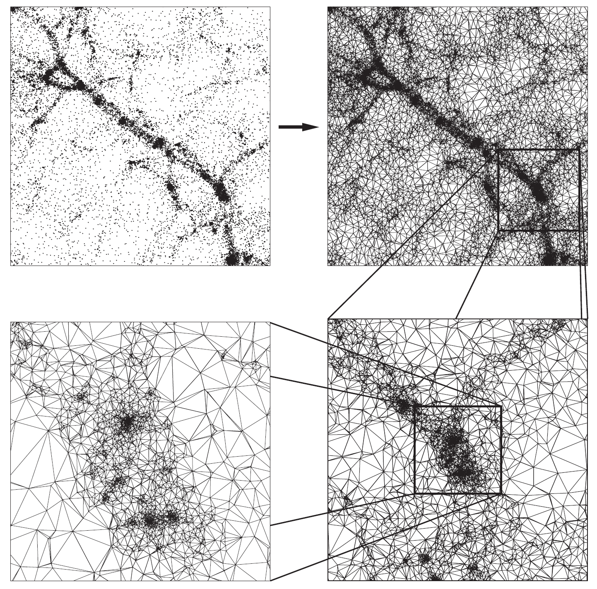
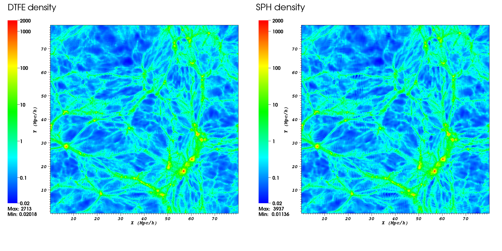
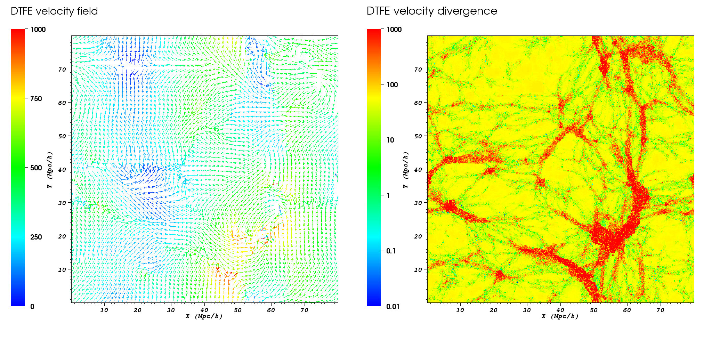

# The DTFE public software

The DTFE public code is a C++ implementation of the **Delaunay Tessellation Field Interpolation (DTFE)** method. Its purpose is to interpolate quantities stored at the location of an unstructured set of points to a regular grid using the maximum of information contained in the input points set. In particular, the code can calculate the following cosmological quantities:
* the density field - this is calculated directly from the point distribution,
* the velocity field and derivatives (e.g. gradient, divergence, vorticity) - uses the velocity at each particle position, and
* general vector quantities and their derivatives - these quantities must be given as input for each point in the set.

The code was written with the purpose of analysing cosmological simulations and galaxy redshift survey. Even though the code was designed with astrophysics in mind, it can be used for problems in a wide range of fields where one needs to interpolate from a discrete set of points to a grid.

The code was designed using a modular philosophy and with a wide set of features that can easily be selected using the different program options. The DTFE code is also written using OpenMP directives which allow it to run in parallel on shared-memory architectures.

The code comes with a complete [documentation](docs/DTFE_user_guide.pdf) and with a multitude of examples that detail the program features. A test dataset and analysis of the code output is given in the [demo directory](demo): `./DTFE demo/z0_64.gadget out --grid 64 --field density --periodic --padding 12` works out of the box (the box is periodic, and its voids are wider than the default padding of 5 particle spacings: with it about 1% of the cells would lie outside the tessellation, which the run reports).

The public release of the code is summarised in the arxiv publication [Cautun et al. (2011)](https://ui.adsabs.harvard.edu/abs/2011arXiv1105.0370C/abstract) and it is based on the method paper [Schaap and van de Weygaert (2000)](https://ui.adsabs.harvard.edu/abs/2000A%26A...363L..29S/abstract).


## The DTFE method
The Delaunay Tessellation Field Interpolation (DTFE) method represents the natural way of going from discrete samples/measurements to values on a periodic grid and it is especially suitable for astronomical data due to the following reasons:
* Preserves the multi-scale character of the point distribution. This is the case in numerical simulations of large scale structure where the density varies over more than 6 orders of magnitude.
* Preserves the local geometry of the point distribution. This is important in recovering sharp features like the different components of the cosmic web (i.e. clusters, filaments, walls and voids).
* The method does not depend on user defined parameters or choices.
* The interpolated fields are volume weighted (versus mass weighted quantities in most other interpolation schemes). This can have a significant effect especially when comparing with analytical predictions which are volume weighted.

For detailed information about the DTFE method see [Schaap and van de Weygaert (2000)](https://ui.adsabs.harvard.edu/abs/2000A%26A...363L..29S/abstract), [van de Weygaert and Schaap (2009)](https://ui.adsabs.harvard.edu/abs/2009LNP...665..291V/abstract), and [Cautun et al. (2011)](https://ui.adsabs.harvard.edu/abs/2011arXiv1105.0370C/abstract).

|  |
|:------:|
| Figure 1: *An illustration of the 2D Delaunay tessellation of a set of particles from a cosmological simulation. Courtesy: Willem Schaap.* |

|  |
|:------:|
| Figure 2: *An example of the DTFE density field form a cosmological simulation. The right panel shows the same result but now using the smoothed particle hydrodynamics (SPH) method.* |

|  |
|:------:|
| Figure 3: *A map of the DTFE computed velocity flow (left panel) and velocity divergence (right panel) corresponding to the density field shown in Figure 2.* |


## Summary of software features

* Works in both 2 and 3 spatial dimensions.
* Interpolates the fields to three different types of grids:
  + Regular rectangular and cuboid grid - useful for cosmological simulation.
  + Redshift cone (spherical coordinates) grid - useful for galaxy redshift survey or for mock observations.
  + User given sampling points - can describe any complex or non-regular sampling geometry
* Returns both the value at the centre of each cell of the interpolation grid as well as the value averaged over each cell.
* Uses the point distribution to compute the density and interpolates the result to grid.
* Each sample point has a weight associated to it to represent multiple resolution N-body simulations and observational biases for galaxy redshift surveys.
* Interpolates the velocity, velocity gradient, velocity divergence, velocity shear and velocity vorticity.
* Interpolates any additional number of fields and their gradients to grid.
* Periodic boundary conditions.
* Zoom in option for regions of interest.
* Splitting the full data in smaller computational chunks when dealing with limited CPU resources.
* The computation can be distributed in parallel on shared-memory architectures.
* A phase-space (Lagrangian) variant, `PS-DTFE`, that recovers the multi-stream structure of the cosmic web - the multi-stream density, the velocity dispersion, and the caustic surfaces.
* Exact, sampling-free field estimation as an alternative to Monte-Carlo cell averaging, and evaluation of the fields at arbitrary user-supplied points, with exact point location (a point on a shared face or vertex is counted once per stream).
* An interactive mode: the tessellation is built once and then queried from Python at any points, as often as needed (`dtfelib.Estimator`), on a snapshot file or on particles held in numpy arrays; boxes too large for one tessellation are served as a composite of partitions kept on disk.
* For every stream at a point, the Lagrangian position its matter started from, and any per-particle quantity interpolated along it.
* Automatic choice of the domain decomposition and memory footprint from the data and the machine, with an optional out-of-core mode for grids larger than the available memory.
* The tessellation can be cached on disk and reused by later runs, which skips its construction entirely when the same data is analysed again.
* Optional GPU acceleration of the field deposit on Apple Silicon (Metal) and, as a port of the same kernels, on Linux with an NVIDIA (CUDA) or AMD (HIP) GPU, covering every grid field of both estimators (density, velocity, dispersion, gradients, a scalar field and the exact deposits); and an optional double-precision build.
* For comparison purposes, the software comes also with three other simpler interpolation techniques: nearest grid point (NGP), triangular shape cloud (TSC) and smoothed particle hydrodynamics (SPH).
* Returns the Delaunay tessellation of the given point set.
* Easy change of input/output data format.
* Easy to use as an external library.
* Extensive documentation of each feature.


## Installation and Building

### Supported Platforms
- **macOS** (Intel and Apple Silicon)
- **Linux** (Ubuntu, Debian, Fedora, CentOS, RHEL, and other distributions)

### Prerequisites

#### macOS
1. **Install Xcode Command Line Tools:**
   ```bash
   xcode-select --install
   ```

2. **Install Homebrew** (if not already installed):
   ```bash
   /bin/bash -c "$(curl -fsSL https://raw.githubusercontent.com/Homebrew/install/HEAD/install.sh)"
   ```

3. **Install dependencies:**
   ```bash
   brew install gsl boost cgal mpfr gmp hdf5 fftw llvm libomp
   ```

#### Linux (Ubuntu/Debian)
```bash
sudo apt-get update
sudo apt-get install build-essential
sudo apt-get install libgsl-dev libboost-all-dev libcgal-dev libmpfr-dev libhdf5-dev libgmp-dev libfftw3-dev
```

#### Linux (Fedora/RHEL/CentOS)
```bash
# For Fedora
sudo dnf groupinstall "Development Tools"
sudo dnf install gsl-devel boost-devel CGAL-devel mpfr-devel hdf5-devel gmp-devel fftw-devel

# For older RHEL/CentOS
sudo yum groupinstall "Development Tools"
sudo yum install gsl-devel boost-devel CGAL-devel mpfr-devel hdf5-devel gmp-devel fftw-devel
```

#### Linux (Arch/Manjaro)
```bash
sudo pacman -S base-devel gsl boost cgal mpfr hdf5 gmp fftw
```

### Quick Start

1. **Clone the repository:**
   ```bash
   git clone <repository-url>
   cd DTFE
   ```

2. **Check the platform and dependencies:**
   ```bash
   make test-platform    # shows the detected platform, compiler and paths
   make deps-check       # verifies every required header and prints the install command for anything missing
   ```

3. **Build the executables:**
   ```bash
   make DTFE             # standard DTFE
   make PS-DTFE          # phase-space DTFE (see below)
   ```
   `./PS-DTFE --version` prints the git revision and time of the build, which every run also writes into its log.

   On Apple Silicon, add `METAL=1` (e.g. `make DTFE METAL=1`) to run the volume-averaged interpolation / phase-space deposit on the GPU, with automatic fall-back to the CPU. On Linux, `CUDA=1` (NVIDIA, needs the CUDA toolkit's `nvcc`) or `HIP=1` (AMD, needs ROCm's `hipcc`; set `GPU_ARCH` to the card's architecture) builds the same deposit from a port of the Metal kernels; that port compiles (with `nvcc` and with ROCm's `hipcc`, both checked in CI) and falls back to the CPU correctly on Linux, but has not yet been validated on NVIDIA or AMD hardware, so its first run on a GPU machine should be the parity checks named in `metal/README.md`. As a shortcut, `./scripts/install.sh` installs any missing dependencies, builds both binaries with the best backend for the machine, installs the Python package (next step), and sets up the graphical launcher (see below; `--no-gui` leaves it out, e.g. on a cluster).

4. **Install the Python package** (`dtfelib`: loaders, analysis and the interactive `Estimator`):
   ```bash
   python3 -m pip install -e python
   ```
   Install it editable, so that it finds `./DTFE` and `./PS-DTFE` in the repository; otherwise point `DTFE_BIN_DIR` at the directory holding them.

5. **Build the shared library:**
   ```bash
   make library
   ```

6. **Clean build files:**
   ```bash
   make clean
   ```

7. **Run the tests** (optional):
   ```bash
   tests/ci_suite.sh core      # every CPU suite against ./DTFE and ./PS-DTFE
   ```
   `tests/ci_suite.sh` is the one list of suites that both the GitHub workflow (`.github/workflows/ci.yml`) and the Docker image run: `build` builds the single, double and 2D pairs, `double` repeats the suites against the double pair, `2d` runs the 2D suite and `gui` the launcher's tests. The GPU suites (`tests/dtfe_metal_check.sh`, `tests/gpu_scalar_check.sh`) need a GPU build and are run by hand.

### Configuration Options

The software behavior can be configured by editing the `OPTIONS` section in the Makefile:

#### Spatial Dimensions
The number of dimensions is chosen per build, without editing anything:
```bash
make DTFE          # 3D (default)
make DTFE DIM=2    # 2D
```
A 2D build is a set of its own, `DTFE-2d` and `PS-DTFE-2d` (`-2d-double` with `DOUBLE=1`), built from its
own object directories, so the 2D and 3D binaries coexist; it is CPU-only. Phase-space DTFE works in
2D since 2 October 2026 (`make PS-DTFE DIM=2`): it reads the same Gadget-HDF5 layout with two-column
`Coordinates`, `Velocities` and `InitialCoordinates` (`tests/generate_ps_test_data.py --dim 2` writes
such files), and supports the sampled and exact deposits (the exact one clips each triangle against
the cells itself), the stream counts and hidden-stream flags, the velocity, dispersion and gradient
fields, `--ps-vertex-mass`, `--ps-volume-weighted`, `--ps-halo-release`, `--ps-linear-deposit`,
`--ps-caustics` (the parity bits and the collapse multiplicity, which runs to 2 in 2D), `--partition`,
periodic and non-periodic boxes, the tessellation cache and point evaluation (`--sample-points`, with
the points as `x y` text lines or raw float64 pairs; the `.pts_*` vectors then carry two components,
the dispersion three, the velocity gradient four), `--ps-window`, and `--ps-caustic-cusps`, which flags
the cusps where a fold line turns tangent to its null direction (there is no swallowtail bit in 2D: a
swallowtail is a moment of a 2D flow, not a point of it). The standard `DTFE-2d` averages exactly too
(`--exact-average`, clipping its triangles against the cells itself), and the interactive server works
in 2D too (`--serve`; `dtfelib.Estimator(..., dim=2)` or `Estimator.from_arrays` on (N, 2) arrays, and
`grid(xs, ys)`), its handshake telling the client the dimension. `tests/ps_2d_check.sh` checks it against analytic 2D Zel'dovich flows: the stream count in every
column of a pancake, the separable stream fractions of crossed waves, the convergence of the
single-stream density and velocity, the sampled deposit converging to the exact one, point
evaluation, whose stream counts at the cell centres equal the grid's exactly, the window against the
full run, the cusp flag against the two analytic cusps of a pancake modulated along y, and the exact
average against a perfect lattice. Until then a
2D build refused to compile: its input could not be read (a 3D file overran the 2D reader) and its
deposit had reported 62 streams where at most 3 exist. The T-web works in 2D too since 3 October 2026
(the same FFT Poisson solve; two eigenvalues, so the classes are 0 void, 1 filament, 2 node), checked by
`tests/tweb_check.sh` as in 3D plus an independent numpy solve of crossed waves for the cross term; the
GPU and the parallel triangulation stay 3D only. The graphical launcher runs 2D snapshots as well (see
below).

#### Variable Precision
The precision is chosen per build as well:
```bash
make DTFE PS-DTFE                   # the single-precision pair (default): ./DTFE, ./PS-DTFE
make DTFE PS-DTFE DOUBLE=1 METAL=1  # the double-precision pair as well: ./DTFE-double, ./PS-DTFE-double
```
`DOUBLE=1` keeps every position, density, field and accumulator in double precision, from the
input read onward -- the Gadget-HDF5 reader then keeps the full precision of snapshots that store
their coordinates in double (IllustrisTNG does), which the default build rounds on read -- and
writes the output grids as float64 (`dtfelib` and the launcher read either). It costs about twice
the memory. The double pair is a separate set of binaries built from its own object directories
(`o_d/`, `o_ps_d/`), so both precisions coexist: the run scripts pick the pair with
`DTFE_PRECISION=double`, the launcher with its precision setting, and `scripts/install.sh --double`
builds it next to the single one. The GPU is available to it: the GPU kernels (Metal, CUDA, HIP) are single
precision, so a double build hands the GPU float copies of its tetrahedra and adds the float sums
into its double grids, while reading, triangulation, densities, point evaluation and the CPU
deposits stay double. `tests/ps_double_check.sh` compares the two pairs on the same snapshot: the
grids agree the way two single-precision paths do (a few borderline samples change cell), stream
counts and caustic flags are identical, and the double pair's GPU deposit matches its own CPU run
like the single build's. Every suite that runs the programs also runs against the double pair:
`DTFE_TEST_PRECISION=double tests/<suite>` (or `tests/ci_suite.sh double`) points it at
`./DTFE-double` / `./PS-DTFE-double` and reads their float64 grids, with the same checks as the
single pair; only the comparisons of the GPU's stream counts with the CPU's exact ones allow one
cell in ten thousand to differ there, since the GPU works on float copies of the double tetrahedra.

#### Computed Quantities
```makefile
OPTIONS += -DVELOCITY          # Enable velocity computations
OPTIONS += -DSCALAR            # Enable scalar field interpolation
OPTIONS += -DNO_SCALARS=1      # Number of scalar components
```

#### Input/Output Defaults
```makefile
OPTIONS += -DINPUT_FILE_DEFAULT=105   # HDF5 gadget format
OPTIONS += -DMPC_UNIT=1000            # Data units (kpc in this example)
OPTIONS += -DOUTPUT_FILE_DEFAULT=101  # Binary output
```

#### Additional Features
```makefile
OPTIONS += -DOPEN_MP              # Enable OpenMP parallelization
OPTIONS += -DTEST_PADDING         # Validate Delaunay tesselation padding
OPTIONS += -DREDSHIFT_SPACE       # Enable redshift space computations
OPTIONS += -DTRIANGULATION        # Enable triangulation access
```

See the Makefile for the complete list of available options.


## Phase-Space DTFE

Standard DTFE builds the Delaunay tessellation in Eulerian (present-day) space and returns a single-valued density at each point. **Phase-Space DTFE** builds the tessellation in Lagrangian (initial-condition) space and follows it as it is deformed to the present day. Because the deformed tessellation can fold over onto itself, the method recovers the *multi-stream* structure of the cosmic web: the density at a point is the sum over every stream (folded simplex) that covers it, and the number of streams is returned as a field of its own. This makes it especially suited to caustics and to the multi-stream interiors of voids, where the single-stream estimate breaks down. The method follows the phase-space tessellation approach of Abel, Hahn & Kaehler (2012) and Shandarin, Habib & Heitmann (2012).

Phase-Space DTFE is built as a separate `PS-DTFE` executable (the `-DPHASE_SPACE` compile option, set automatically by the target so that it can coexist with the standard build):
```bash
make PS-DTFE            # add METAL=1 on Apple Silicon (CUDA=1 / HIP=1 on Linux) to run the deposit on the GPU
```

It needs **two positions per particle** — the present-day (Eulerian) position and the initial-condition (Lagrangian) position — read from a Gadget-HDF5 file, either from an `InitialCoordinates` dataset in the same file or from a separate initial-conditions snapshot given with `--lagrangianInput`:
```bash
./PS-DTFE snapshot.hdf5 output_root --grid 256 --periodic --field density --lagrangianInput ics.hdf5
```

In addition to the standard fields, `PS-DTFE` returns the number of streams per cell, the velocity dispersion (its trace and the full symmetric tensor), and, optionally, the caustic structure of the map (`--ps-caustics`). Because the map of each tetrahedron is linear, its deformation tensor is constant inside it and known exactly, which gives both the fold surfaces — where the orientation of the map flips — and, alongside them, the number of principal axes along which the sheet has already collapsed: one for a wall, two for a filament, three for a node. Cells where two of the deformation eigenvalues coincide, the neighbourhood of an umbilic point, are flagged as well. The higher singularities of the caustic skeleton proper — the cusps — require in addition the derivative of the critical eigenvalue along its own eigenvector, which does not exist inside a tetrahedron where the deformation is constant; `--ps-caustic-cusps` estimates it from the neighbouring tetrahedra and reports the result as a further flag. The estimate is made over all tetrahedra sharing a vertex with the one in question, which matters: fitted from the four face neighbours alone it marked several per cent of the fold cells of a one-dimensional wave that has no cusps at all, and over the wider ring that falls to one cell in ten thousand. It is left switched off unless asked for, since the wider stencil is not free. The same neighbourhood answers the next question in the hierarchy at almost no extra cost, and the flag reports that too: where a cusp is a point at which the critical eigenvalue stops varying along its null direction, a swallowtail is one at which its curvature stops as well, so the estimate fits a cubic along that direction and asks whether the expansion begins only at third order. The separation this achieves is honest but modest — on waves whose singularities are known exactly, a true swallowtail lights some seventeen per cent of the cusp cells, a cusp that is genuinely not one lights one and a half, and an ordinary fold lights none — and it cannot be improved by tightening the test, because a swallowtail is a point rather than a surface and what is really being marked is the neighbourhood of one, over a band as wide as the stencil that measures it. Two refinements of the mass assignment keep the estimate accurate on evolved initial conditions: chart-independent tetrahedron masses (`--ps-vertex-mass`, which distributes each particle's mass over its incident tetrahedra) and volume-weighted velocity moments (`--ps-volume-weighted`, the volume-weighted convention used by standard DTFE). Inside virialised haloes, where the stream count is no longer converged, the thoroughly mixed sheet can be released from the deposit with `--ps-halo-release` following Stücker et al. (2021).


The stream count on the grid is measured the way the fields are, at the sub-samples of each cell (`--avg-subsamples`): it is the number of streams covering a sample, averaged over the cell, and it converges to the volume-weighted stream count as the sampling is refined. A tetrahedron smaller than the sample spacing can contain no sample at all. Its mass is still deposited, in the cell holding its centroid, so mass is conserved exactly, but it adds nothing to the count, which is what keeps the count unbiased; the stream count on its own cannot see a fold thinner than the sampling, so a separate output, `.hidden_streams`, marks the cells that hold multi-stream volume their count misses (exactly: a folded tetrahedron overlaps the cell), and, as a second bit, the cells that received such a sub-sample tetrahedron's mass. A single-stream mask should use both, `.streams` equal to one and bit 1 of `.hidden_streams` clear; `velocity_single_stream()` in `dtfelib` does this. The flag is conservative: it also marks cells in which the unsampled tetrahedron belongs to the one stream that is there, which happens throughout the voids when the tessellation is finer than the sampling. Which tetrahedra contain a sample is decided exactly, by the test described under point evaluation below, so with one sample per cell the grid count is the exact number of streams at the cell centre, in every cell, and a `--partition` split gives the same count as a serial run. When every unsampled tetrahedron was counted as a stream, 11.6% of the cells of a crossed-wave test were too high, by up to 839, and the floating-point inside test that preceded the exact one miscounted a few cells per million. The GPU deposit (`--ps-gpu`) reaches the same decisions: it has no double precision, so it classifies each sample in single precision against a rigorous bound on its rounding error and hands the few tetrahedra it cannot decide that way, those with a sample within rounding distance of a face, to the CPU's exact test; its stream counts are identical to the CPU's.

Whether a tetrahedron is too flat to be inverted is decided relative to its own size, not against a fixed volume, so the result does not depend on the length unit or on the size of the box: the same snapshot scaled into a 1 Mpc box used to lose a fifth of its mass to that test, and now conserves it exactly.

A `--box` region cut from a larger particle cloud keeps exactly the mass that lies inside it. A tetrahedron crossing the region's face deposits only its share inside: its samples beyond the face are counted but not deposited, and in the exact deposit its pieces inside the region are weighed against the whole tetrahedron. It used to give its entire mass to the part inside, so the cells along the faces of a region cut from a TNG100 box held three times the density of their neighbours, and where tetrahedra span many cells the excess reached well into the region. A region now reproduces the same cells of a larger grid to the last digit.

The Lagrangian domain of a non-periodic cloud is its alpha shape rather than its convex hull: only tetrahedra whose Lagrangian circumradius is at most three mean particle spacings are kept (`--ps-alpha-shape`, 0 keeps the whole hull). Interior tetrahedra of lattice-like initial conditions never exceed about 0.9 spacings, in jittered lattices and in TNG100-3 alike, so the cut touches only the boundary. What it removes are the flat slivers that fill the space between the nearly planar faces of the cloud and its hull, joining particles up to a whole face apart, together with the tetrahedra that bridge concavities, such as particles missing from a cut region. Neither is a flow element: their Eulerian images stretch across the cloud and deposit spurious mass and streams wherever they pass. They are also why a non-periodic run split with `--partition` used to differ from a single triangulation along the partition seams, since the hull of a face is a global object that each partition built differently. A tetrahedron within the cut, by contrast, belongs to a partition's triangulation exactly when it belongs to the global one, and the partitions are padded accordingly, so split and single runs now agree to the rounding of their sums. The boundary layer beyond the cut is the price: about half a percent of the mass of an isolated 24³ clump.

Two costs that dominate small runs were cut. The vertex densities are now summed over the cells, each adding its volume to its four vertices, instead of walking every vertex's incident cells and recomputing each cell's volume four times: 0.6 s → 0.14 s for a 0.26M-particle box in `PS-DTFE`, 0.25 s → 0.02 s in `DTFE` (the sums run in double and in a different order, so a density can move in its last float bit). And `PS-DTFE` can build its Delaunay triangulation in parallel (`--parallel-triangulation`, when the `tbb` library was present at build time; `make` detects it, `TBB=0` leaves it out): it uses the performance cores, at most six (`DTFE_TBB_THREADS` overrides: the lock-coupled insert gains nothing from more, and a thread on an efficiency core stalls the rest), shared among the tessellations being built at the same time, so a partitioned run, which already keeps every core busy, inserts as before and only its tail gains. For a small set — below two million particles — the tuner also predicts whether splitting the set into eight or twenty-seven partitions, each triangulated on its own core, beats one triangulation, and splits only for a clear gain: a 0.26M-particle slice takes 1.4 s instead of 2.4 s, its 16.8M point values 4.2 s instead of 5.3 s, while grids, whose deposit already uses every core (and on the GPU serialises anyway), stay in one domain. Such a split merges its partitions in a fixed order, so two identical runs still agree bit for bit; `--partition 1 1 1` asks for one tessellation when the bits of a single-domain run are wanted, for instance to compare with the query server. The parallel insert is off by default because its vertex and cell order differ from run to run, which moves every floating-point output between two identical runs at the level of rounding — the stream counts and the tessellation itself do not change — whereas the sequential insert reproduces bit for bit, which the query server, the tessellation cache and the test suites rely on. With the flag a 0.26M-particle slice takes 1.4 s instead of 2.4 s, and the 27-partition TNG region's GPU grid 110 s instead of 135 s; a partitioned run with more than one concurrent partition was never bit-reproducible, so there the flag costs nothing. The standard `DTFE` binary keeps the sequential insert: its clustered Eulerian points built four times slower in parallel, where the near-lattice Lagrangian points of `PS-DTFE` build about twice as fast.

The CPU deposit of `PS-DTFE` runs on every core by giving each thread its own copy of the accumulators, summed at the end; those copies are capped at a fifth of the memory, so on a fine grid, where one copy of the density and velocity accumulators is 24 GB at 1024³, the cap left a single thread. When the copies would leave fewer than half the threads, the deposit now divides the grid into slabs along x instead: each thread takes whole slabs as it comes free and writes only their cells, walking each slab's tetrahedra in the order of the single-threaded loop, so every cell receives its contributions in exactly that order and the result is identical, bit for bit, to a single-threaded deposit at any thread count (`tests/ps_slab_deposit_check.sh` compares every output file for every deposit variant). The slabs are cut where the estimated work, not the width, is equal, so a clustered box does not leave one thread with its halos. A 0.26M-particle box on 1024³ deposited in 65 s instead of 245 s, faster than the GPU's 160 s; on 768³ in 28 s instead of 64. `DTFE_DEPOSIT_SLABS=1` forces the slabs and `0` forbids them, `DTFE_DEPOSIT_THREADS` sets the thread count.

## Phase-space density

The distribution function of a collisionless sheet cannot be tabulated: it is a sum of delta
functions, one per stream. Standard DTFE therefore offers an *approximation*, `--approxPSD`, which
builds a second Delaunay tessellation in velocity space and multiplies the spatial and velocity
densities, f ≈ ρ(x)·g(v) — a factorisation that is reasonable in a cold, single-stream flow and
breaks down exactly where streams cross. Phase-Space DTFE needs no such assumption: it resolves
the streams themselves, so the exact distribution function is the per-stream decomposition it
already reports (`--sample-points --per-stream`), and the usual scalar proxy Q = ρ/σ³ follows from
the multi-stream density and dispersion it deposits (`dtfelib.fields.pseudo_phase_space_density`).
Running the two against each other measures how far the factorised estimate drifts in the
multi-stream regions where the phase-space structure actually matters.

## Field evaluation methods

The value assigned to a grid cell can be either the field at the cell centre or the field averaged over the cell volume; the volume average is normally estimated by Monte-Carlo sampling (`--method`, `--samples`). Two alternatives remove the sampling noise entirely:

* **Exact volume averaging** (`--exact-average`, standard DTFE) integrates the linear DTFE interpolant analytically over every grid-cell/tetrahedron intersection using the vendored [r3d](third_party/r3d/README.md) library (Powell & Abel 2015); with `--gpu` the clipping runs on the GPU (a float32 port of r3d that agrees with the CPU to float rounding, 6.6 times faster than the CPU on a 0.26M-particle box at 256³). For a linear field the integral over each intersection is its centroid value times its volume, so the averaged field carries no sampling noise at any resolution.
* **Exact conservative deposit** (`--ps-exact-deposit`, PS-DTFE) does the same for the phase-space deposit: each stream is clipped analytically against the grid and deposits its mass exactly, with the velocity and dispersion following from the linear profile over each intersection. An intermediate option, `--ps-linear-deposit`, keeps the sampled deposit but weights each sub-sample by the linear density profile inside its stream.
* **A window of the grid** (`--ps-window x0 x1 y0 y1 z0 z1`, PS-DTFE, coordinates in Mpc) deposits, allocates and writes only the cells of the full `--grid` inside that box. The tessellation is the full run's (periodic or not, with or without `--partition`) and so is every stream's normalization, so the window's cells are the full run's: bit for bit for the sampled deposit (a stream straddling the window edge counts all its sub-samples and deposits the part inside), to float rounding for the exact deposit (only the window's cells are clipped and each stream is normalized by its whole weight, which equals the sum over all its pieces to double rounding). The cost scales with the window, not the grid: a 4096³ grid over a 100 Mpc box windowed to one 512² slice holds a quarter of a million cells and runs in seconds after the tessellation. A box beyond the periodic edge wraps. With `--tessellation-cache` and `--partition`, a window run loads the cached partition tessellations instead of rebuilding them and skips every partition whose occupancy map (written beside its tessellation by the query server or by an earlier partitioned run) shows that its streams never reach the window: on TNG100-3-Dark (94 million particles, 4×4×4 partitions cached by the query server) a 512² exact window processes 12 of the 64 partitions and takes about 15 s, where it took about an hour before. Three things make that possible beyond the skipping. A partitioned run with a cache records the totals it derives from all particles (their number, the mean density and the bounding box of their initial positions) beside the partitions, so a later window run whose partitions are all cached does not read the snapshot at all (16 s and 12 GB of memory on TNG100-3-Dark), and reads it after all only if a partition it needs turns out to be missing. On the GPU, the vertex masses of `--ps-vertex-mass` are counted only for the tetrahedra that reach the window, which halves each partition's deposit. And the cached tessellations are compressed in independent chunks, written and decompressed on several cores. Not combinable with the T-web/V-web classes (they need the whole periodic grid), `--region`, `--partNo` or `--ps-linear-deposit`.

The caustic structure is reported at the sampling points as well, so the fold skeleton can be drawn at the full resolution of a point-evaluated image plane rather than at the resolution of a grid. The two cosmic-web classifications are a different matter: the T-web follows from the tidal tensor, a global solve over the whole density grid, and the V-web from the velocity shear under the normalisation the binary applies, so neither is a local quantity that point evaluation could produce by itself. They are instead sampled from the grid at the very positions the plane was evaluated at (`dtfelib.io.PointPlane.sample_grid_field`), which keeps them identical to the classification the grid reports.

Besides the regular grid, **both binaries** can evaluate their fields at **arbitrary points** supplied by the user (`--sample-points`) — halo or void centres, sight-lines, or the pixels of a high-resolution image plane. The points are read from a text file (one `x y z` per line) or a raw-binary file, and one record is written per point. For `PS-DTFE` this returns the full per-stream decomposition at each point (`--per-stream`); for the standard binary it is the ordinary single-valued DTFE interpolant.

Point location is exact. Which tetrahedra contain a point is decided with exact orientation predicates, and a point lying exactly on a face, an edge or a vertex -- a query at a particle position lies on the vertex shared by some twenty-five tetrahedra -- is assigned by a symbolic perturbation that every tetrahedron resolves the same way, so it is counted once per stream, never twice and never not at all. Periodic copies of a particle, whose coordinates differ from the original's by the rounding of the box shift, are mapped to one canonical position first, so the same holds across the periodic boundary and under any `--partition` split. A plain floating-point test with a tolerance does not have this property: at particle positions it reports the whole vertex star, some twenty-five spurious streams, and near shared faces it double-counts a small fraction of all points. The exact decision is only invoked for points within rounding distance of a face; everywhere else a floating-point test decides, with a margin that provably agrees with it, so it costs nothing measurable. The evaluation itself runs on all cores. The CPU grid deposit uses the same test for its sub-samples; with 27 samples per cell it is even some 20% faster than the tolerance test it replaced, which computed every sample's position in full before rejecting most of them.


## Interactive point evaluation

A `--sample-points` run evaluates one fixed set of points and ends. For exploratory work the tessellation can instead be kept alive and queried from Python whenever needed, at any points, without rebuilding it:
```python
from dtfelib import Estimator

with Estimator("snapshot.hdf5") as est:       # PS-DTFE; the tessellation is built here, once
    f = est(points)                           # (N, 3) points in Mpc
    f.density, f.velocity, f.streams, f.dispersion
    rho = est.density(halo_centres)
    cube = est.grid(xs, ys, zs)               # the fields on the grid xs x ys x zs
```
Behind it the binary runs with `--serve`: it builds the tessellation and the vertex densities exactly as a normal run does, and then answers point requests over its standard input and output until the Python object is closed. Every answer is bit-identical to what `--sample-points` would write for the same points, the per-stream records, gradients and caustic flags included (`Estimator(per_stream=True, density_gradient=True, ...)`), and `phase_space=False` gives the standard estimator. A small request only visits the tetrahedra near its points, through a cell index built once when the server starts, so a single point is answered in some tens of microseconds, the round trip from Python included; a large one runs on all cores. Combined with `--tessellation-cache` (`Estimator(..., tessellation_cache=dir)`), even starting a session on a snapshot seen before is immediate. Velocities are returned in peculiar km/s, the convention of the rest of `dtfelib`.

Particles that are not in a snapshot file can be handed over as arrays, the way CosmoDTFE's estimators take them; they are written to a temporary file that the server reads and that is removed again when the session closes:
```python
est = Estimator.from_arrays(x, velocities=v, lagrangian=q, values=phi, box=100.0,
                            per_stream=True, lagrangian_positions=True)
f = est(points)
f.stream_lagrangian        # (R, 3): for each stream at each point, where its matter started
f.stream_scalar            # (R,): 'values' (e.g. the potential) along that stream
f.scalar                   # (N,): its density-weighted mean over the streams at the point
```
Without `lagrangian` the arrays give the standard estimator, and without `box` the particles' own bounding box is used and the data is taken to be non-periodic. The same two outputs exist for any run: `--pts-lagrangian` writes each stream's Lagrangian coordinate q(x), the inverse of the folded map from initial to present positions (`.pts_stream_lagpos`), and `--pts-scalar` interpolates a per-particle quantity read with `--scalar-dataset NAME` from the snapshot (`.pts_scalar`, and `.pts_stream_scalar` per stream). Both are interpolated with the same weights as the velocity; on crossed Zel'dovich waves x - q(x) equals v/100 on every stream to the last floating-point digit.

A box too large for one tessellation is served as a composite of partition tessellations, the out-of-core counterpart of CosmoDTFE's `CompositeEstimator` (`Estimator(..., partition=4, tessellation_cache=dir)`, or `--serve --partition 4`; with a cache directory the code also switches to it by itself when one tessellation would not fit in memory, and then picks the split itself: one already in the cache for that snapshot, the finest complete one, so nothing is built again, and otherwise the split that holds about eight partitions in memory, the number a zoom touches -- on TNG100-3-Dark a cold 512² zoom took 9.8 s with 4³ partitions, ten of them held, against 19.7 s with 3³, four held). The partitions are built once, in parallel, and written to the cache; for each partition a coarse map of the region its tetrahedra cover is kept, so a request only visits the partitions that can hold one of its points, and only a few partitions are held in memory at once, the least recently used being dropped and reloaded on demand: by default as many as fit in the memory budget, counting each partition's tessellation (about 0.67 KB per vertex, measured) and the cell indexes that exist, or a fixed number with `resident` (`--serve-resident`). Until 2 October 2026 every partition was counted with an index it rarely has, which held TNG100-3-Dark's 14-million-vertex partitions to three where four fit, so a zoom needing four reloaded one each time. A later session with the same inputs starts from the cache without building anything, and a batch run with `--tessellation-cache` and the same `--partition` fills the same cache. The partitions a request needs that are not in memory are read back from the cache in parallel (up to eight at a time, within the resident limit) while the ones already in memory are evaluated, so the first request in a new region costs about one partition load rather than one per partition: on a 2-million-particle box split into 27 partitions, 3.9 s instead of 16 s. With `--serve-progress` (`Estimator(..., progress=True)`) the server writes a plain progress line to its log for every partition it builds or a request visits, saying whether that partition was in memory or loaded from disk, and a summary per request; the launcher's progress bar reads them. A partition's cell index, which speeds up small requests, is built only once that partition has answered eight requests while in memory; until then it is walked (on a TNG100-3-Dark partition of 14 million vertices the index takes about 20 s to build and a walk about 1.2 s, so building it at once made the first zoom or click in a region several times slower, and a region needing more partitions than fit in memory rebuilt it on every request). An index is also built only when it fits in the memory budget next to the partitions in memory, since evicting a partition for it would cost a reload; otherwise the request walks, and the progress log says so. The answers are bit-identical to `--sample-points` with the same partition split; against a single tessellation the stream counts are identical and the values agree to floating-point rounding.


## Automatic memory management

Large runs are split into smaller computational chunks (`--partition`) that are processed a few at a time (`--max-concurrent`), so that the peak memory stays within the machine. When these options are not supplied the code **chooses them automatically** from the particle count, grid size, requested fields and the machine's memory and core count, printing the chosen decomposition and the predicted peak memory before it starts; any explicit option always takes precedence, and `--partition 1` asks for a single, unsplit computation. The memory it plans for is at most 60% of the machine's RAM, and never more than what the programs already running leave free (less a few GB of headroom), so the computer stays usable during a run; `DTFE_MEM_FRACTION` changes the share and `DTFE_MEM_BUDGET_GB` sets the budget outright. Very fine grids work beyond the 32-bit cell counts: a 1300³ grid (2.2 billion cells) on the CPU and a 1700³ grid (4.9 billion) on the GPU, both with the grids on `--scratch-dir`, reproduce the 2×2×2 block means of a run at half the resolution with twice the sub-samples (the same sample points) to float rounding. The GPU kernels number a partition's sub-grid cells with 32 bits, so with the GPU on the code now splits until every sub-grid holds fewer than 2³² cells (a 1700³ grid: 2×2×2) instead of falling back to the CPU, and a small particle set on such a grid splits for memory instead of staying in one domain over budget. The T-web's FFT is planned with FFTW's 64-bit interface, so it is no longer refused above 2³¹ cells; at that size its double-precision work arrays need on the order of 100 GB, and since they are ordinary allocations `--scratch-dir` backs them with disk like the grids: a 1300³ T-web (2.2 billion cells) ran on a 64 GB machine in 19 minutes, its classification checked in every cell. The memory of a phase-space point evaluation (`--sample-points`) grows with the number of streams crossing each point, which rises steeply towards low redshift; the code estimates it from the particles before it starts (the Eulerian over the Lagrangian volume of the tessellation, measured on a few hundred small patches) and plans with a generous margin on top, since a single plane can cross more collapsed structure than the box average. Each stream is stored with only the quantities that were asked for (42 bytes per stream at the least, 114 with `--pts-vel-grad`, instead of 176), which leaves every output unchanged. `--auto-tune-report` reads the input, prints the decision and the predicted peak memory as one line, and stops, so a configuration can be checked before it is run. When even a single chunk of the full-resolution grids would not fit in memory, the grids can be backed by memory-mapped files on a local disk with `--scratch-dir`, trading disk space for RAM while leaving the results unchanged.

## Reusing the tessellation

Constructing the Delaunay tessellation and the densities at its vertices is the dominant fixed cost of a run — measured at 81% of the total for a snapshot of 884736 particles — and it is repeated in full every time, even when the same snapshot is analysed again with a different grid or a different set of sampling points. `--tessellation-cache <local dir>` writes the finished tessellation to disk once and reuses it in later runs, which skips both stages (the same example run takes 10.9 s without the cache and 4.6 s with it). For phase-space runs the interpolation grid, the fields and the sampling points may all change and the cached tessellation is still valid, since it is built in Lagrangian space and does not depend on them — which is what makes repeated point evaluation on one snapshot cheap. Anything that would change the tessellation itself or the densities stored in it — a modified input file, a different box, region, padding, periodicity or density normalisation, or a different build of the code — is detected and the tessellation is simply rebuilt, so a stale cache can never produce a wrong result. (Periodicity was missing from that list until 30 September 2026: a standard-DTFE run could load the tessellation a run with the other setting had cached. A periodic phase-space run in one piece, without `--partition`, rebuilds a tessellation cached before 2 October 2026 once: its ownership box, part of the identity, moved that day to fix a mass loss on lattice initial conditions.) The input files are identified by their resolved path, so a relative name, a name through a symbolic link, or other letter case of the same file finds the same cached tessellation; before 2 October 2026 each such name was a separate key and a rebuild (a cache written through such a name then is rebuilt once). The cached file is compressed and costs about 0.15 KB per tessellation vertex. Since 2 October 2026 it is compressed in independent 16 MB chunks, written and decompressed on several cores, which made writing a partition 3.6 times and loading it 1.7 times faster; files in the older single-stream format still load, and `python/tools/upgrade_tess_cache.py <cache folder>` converts them, checking each file's content before replacing it (an older binary cannot read converted files). After that, most of a load was CGAL's own reader taking every vertex and cell index through a separate stream call; the cache now reads and writes the same bytes in blocks and builds the triangulation through the same calls in the same order, so the result is CGAL's exactly (the tests compare a hash of the loaded structure and the written files byte for byte). For 3.65 million vertices a load went from 3.2 s to 0.9 s and a save from 3.8 s to 2.2 s; with eight loads at once, decompression on the shared cores is now the limit (2.5 s each instead of 5.6 s). The 512² exact zoom on TNG100-3-Dark, three partitions at a time, went from 27 to 15 s. When libdeflate is installed (`brew install libdeflate`, `apt-get install libdeflate-dev`; the Makefile finds it, `LIBDEFLATE=0` builds without it) the chunks are compressed and decompressed with it instead of zlib: on this Mac compression is 2.4 times faster and 3% smaller, which made a save 12% faster, while a load gains little (1.13 times). On Linux (Ubuntu 24.04) it is much the same: a 2.1-million-vertex tessellation saved in 2.0 s instead of 2.3 s and loaded in 1.15 s instead of 1.28 s. The chunks are already decompressed on all cores, so the codec is only a small part of either. Both codecs write plain gzip, so every build reads every cache, and a run that loads one names the codec it used.

## Graphical launcher

`scripts/gui.sh` opens a window (PySide6, a prototype) for the things normally typed in a terminal. The **Data** tab gets a simulation onto disk: it shows, for every snapshot of the redshift ladder, whether its particles and group catalogue are there as raw chunks or merged, downloads the snapshots, group catalogues, merger trees and initial conditions from the TNG API (`download_snapshots.sh`, with the API key read from `~/.tng_api_key` and never shown), and merges them into the h-free combined files the rest of the code reads (`merge_HDF5.py`), leaving out whatever is merged already and estimating the download size against the free disk space. For the other tabs the simulation and snapshots are chosen from what is found under the data root, with their redshifts and which have been processed already. The **Grids** tab puts together one run of either estimator: the deposit and grid, the fields, the phase-space options, a high-resolution slice and the memory settings. The **Pipeline** tab runs `run_ps_pipeline.sh` for the chosen simulations, which computes the grids and a full-box image plane for every snapshot that is missing or out of date, and then renders the point-evaluated figures; it takes the same run options as the Grids tab (the deposit and its sub-samples, the GPU, vertex masses, volume-weighted velocities, caustics and cusps, the parallel triangulation), the plane's geometry (several planes across a slab for a projected view, sub-samples per pixel for pixel-area means, a window of the plane) and the figure options of the render step (fields, projection, smoothing, the fixed density range), and a plane already on disk is reused only when its geometry is the one asked for. The **Plots** tab runs the figure scripts of `python/plot` (field slice maps, cosmic-web classes, the point-evaluated maps and publication panels, void population and tracking, halo tracking, and the analysis set of `analyze.py`), each with its own options. In every tab the window shows the exact commands these choices stand for, which can be copied and run in a terminal just the same; it flags combinations that would be refused or would not fit in memory (including another DTFE run already going; a query server, the Explore tab's or any other, is not one), and then runs the commands in order with their progress, log and a stop button, either at once or as a job in a **queue**. Jobs from any tab can be queued, reordered and removed; the queue runs them one after another, stops at a failed job unless told otherwise, waits before a grid or pipeline job while another DTFE run is using the machine, and is kept when the window is closed. A queued job keeps the settings it was queued with and works out its commands when it starts, so it sees what the jobs before it wrote. Before a large run, **Check memory** (Grids, Custom snapshot and Pipeline tabs) asks the code itself, snapshot by snapshot, how much memory the chosen settings will need on this machine and how it will split the work, and warns about every snapshot that would not fit (which would make the computer swap and slow down); for the pipeline it also tries smaller image planes and names the largest that fits, and with **Adaptive** the pipeline then uses, per snapshot, the largest plane that fits. The GPU box follows where the deposit pays on this machine: ticked for the exact deposit and from about a million particles, left off for small files, and on for standard DTFE as well (its GPU interpolation is 1.5 to 2.3 times faster than the CPU on 512³ grids, a tie on 256³), with a warning whenever the chosen setting is the slower one. The deposit choice (sampled or exact) applies to standard DTFE as well, where exact means the exact cell average of the interpolated field (`--exact-average`, `run_dtfe.sh -e`), 6.6 times faster on the GPU (4.1 s against 26.9 s at 256³ with 0.26M particles), so picking it ticks the GPU; the parallel triangulation of small runs is a box of its own, off by default because two identical runs then differ at float rounding. A **Precision** choice on the Grids, Custom snapshot and Pipeline tabs runs the double-precision pair instead of the default single one (the estimate doubles, and the choice says so when the pair is not built; Setup builds it). The figures a run writes are listed and previewed beside the log. `scripts/install.sh` installs PySide6 for it in an environment of its own (`~/.venvs/dtfe-gui`, about 1 GB, which sees the numpy and h5py of the main Python), checks that Qt loads, and makes the window launchable like any other application (`scripts/install_gui_app.sh`): on macOS a **DTFE Launcher** app in the Applications folder with a shortcut on the Desktop, on Linux an entry in the applications menu. The app starts the GUI with the same environment a Terminal window has (the Python, `wget` and data root of the login shell). macOS protects iCloud Drive and external drives, and refuses such an app rather than asking, so on a Mac it needs **Full Disk Access** once (System Settings, Privacy & Security); it says so, and opens that page, when it is refused. To set the environment up by hand instead:
```bash
python3 -m venv ~/.venvs/dtfe-gui --system-site-packages
~/.venvs/dtfe-gui/bin/pip install PySide6
```

The first time it opens, the launcher walks through what a new user needs (the **Setup** button brings it back): a folder for the data, whether the programs are built (with a button that builds them and shows the `make` command it runs), the TNG API key for downloads if one is wanted (saved to `~/.tng_api_key`, readable only by its owner), and a **demo**: a small synthetic simulation of crossed Zel'dovich waves, folded into 1, 3, 9 or 27 streams, that is generated and run in a few seconds and then opened in the Explore tab, so a first result appears without downloading anything. Data that is not IllustrisTNG goes through the **Custom snapshot** tab, which runs either estimator directly on any Gadget HDF5 or binary snapshot or text file, with the length unit, the box, whether it is periodic (and, for a non-periodic cloud, the alpha shape that bounds its Lagrangian domain) and where the initial positions are stated rather than assumed, and writes its outputs and run log to a folder of its choice. A snapshot in a plane (its coordinates have two columns) runs on the 2D programs: the tab's **Dimensions** setting follows the file when one is chosen (Gadget HDF5 and text files say which), the box then takes four numbers, and the GPU and the parallel triangulation, which are 3D only, are switched off; Setup builds the 2D programs with a tick of its own (`make DTFE PS-DTFE DIM=2`), and Explore shows a 2D run as its one plane, with the query server, the zoom and the exact zoom working on it as in 3D. Explore knows a run's dimension from the settings it saved, and otherwise from the grid files themselves: vectors and tensors have fewer components in 2D, a phase-space run's stream counts are whole numbers only when read in the right precision, and when only scalar grids remain whose size fits a plane and a cube alike (512² cells are as many as 64³), the reading in which neighbouring cells are alike wins. The **Explore** tab shows any run's grids as maps, whatever its size (a slice is read from disk without loading the cube). The output is chosen in two steps, the simulation and then the snapshot by redshift (earliest first); the custom-snapshot runs and any grid files opened by hand have entries of their own in the first menu, listed by name in the second, and a third menu appears only when a snapshot has several outputs, such as a phase-space and a standard run. Then come the field and component, the slice along any axis, the colour scale, logarithmic or linear, and smoothing, with the position and value under the mouse. The vorticity map is the curl of the velocity, the same quantity the zoom and `dtfelib`'s point maps show: the grids store the antisymmetric part of the velocity gradient, half the curl with its components in another order, which the map converts (until 3 October 2026 it showed those stored values under the labels x, y, z, so a zoom read twice the map). It can also start a query server on the snapshot behind the map (the interactive mode above, as a composite of partitions on disk for a large box, in which case it first says how much memory one tessellation would need and how much disk the partitions will take, and asks); a click then lists every stream at that point, with its density, velocity and the position its matter came from, and whether the point lies on a caustic. With the server running, dragging a rectangle on the map zooms into it by re-evaluation: the server evaluates a dense plane of points inside the rectangle (grid-free point evaluation, at a chosen resolution, 512² by default) and the map shows that region at full resolution for the same field and component, with the position and value under the mouse as before; a further drag goes deeper, and Zoom Out (in the Explore menu) returns to the grid slice. This works for the outputs of both estimators (a standard-DTFE server answers with the plain interpolant). Ticking **exact** beside the resolution runs the program itself on the dragged region instead, with the exact deposit, as a grid of that many cells across and one slice cell thick: mass-conserving cell averages rather than point values, a whole run (seconds to minutes, on the GPU when available), no server needed. A standard-DTFE run cuts the region from the box (`--regionMpc`); a phase-space run tessellates the whole box exactly as the original run did, periodic or not, and deposits only into the region as a window of a virtual grid whose cell is the region's size over the resolution (`--ps-window`), so the zoom shows what a full run at that resolution would show there, for any snapshot. It reuses the tessellations the query server keeps on disk (the same cache folder and the same split) and skips the partitions that never reach the region, so on a large snapshot it takes about a minute once the server has been started there once. While it runs, the status line shows what it is doing (reading the snapshot, partition k of n, how many were skipped) and a Cancel button stops it; a zoom estimated to take more than a minute asks first and says why (how many partitions reach the region, how many are cached, how many would have to be built). Every zoom, point-evaluated or exact, shows a progress bar and a running time while it works and its duration when it is done; on a large snapshot's server the bar follows the partitions the request visits, and the status line says how many were in memory and how many had to be loaded from disk. **Back** returns to the previous zoom level from memory, and dragging a region evaluated a moment ago brings it back at once (the last zooms are kept, up to 1.5 GB). The **Runs** tab beside the log lists every run found on disk, from its run log: the settings, when it finished, how long it took, its peak memory and the size of its outputs. It marks outputs made before a fix that changed them (for instance grids from GPU runs split into partitions before 29 September 2026, or stream counts made before the fix of 28 September), judged by the build of the program that made them, which every run now records in its log (`Build:`, also printed by `--version`). A run's settings can be loaded back into the Grids tab to repeat it, and its outputs opened in Explore or moved to the Trash. The time a run will take is estimated from comparable earlier runs; the options can be set from **presets** (a quick look, the standard production settings, figure quality, the exact deposit) or saved as new ones, and their descriptions, shown on hovering, are the program's own help text. When a job fails, the window says what probably went wrong (not enough memory, the data disk missing, an old build, a refused iCloud path) with a button that fixes it where it can; a notification says when a long job or the queue has finished. The commands behind a job can also be saved as a bash script, or as a SLURM batch job to run the same thing on a cluster.


## Contributors
* **Marius Cautun (Kapteyn Astronomical Institute, Durham University, Leiden University)** - *code and documentation.*
* **Rien van de Weygaert (Kapteyn Astronomical Institute)** - *various discussions about the method and implementation.*
* **Luuk Westerhoek (Kapteyn Astronomical Institute, University of Groningen)** - *phase-space DTFE, the exact / point evaluation methods, automatic memory management, the GPU backends (Metal, and its CUDA/HIP port) and the analysis pipeline (bachelor research project "Fate of Cosmic Voids").*


## License

This project is licensed under GNU GENERAL PUBLIC LICENSE Version 3 - see the [LICENSE.md](LICENSE.md) file for details.
